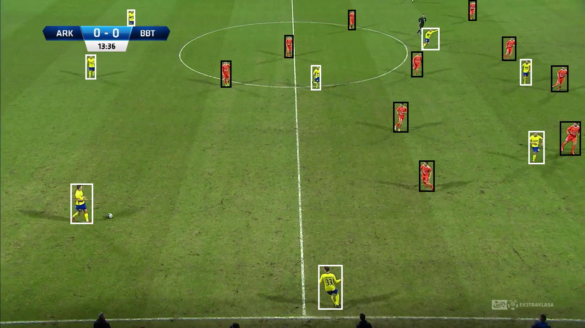

# Problem Definition
Aim of this task is to develop a method for unsupervised team clustering of players during a football match.

You are given a dataset consisting of sample frames and player annotations from 10 different matches from Polish Ektraklasa league. For each frame, we provide information about detected players together with their bounding boxes and pixel masks. Our model was trained to specifically omit goalkeepers, since they wear different colors. However, you may expect infrequent false positives, e.g. a judge detected as a player of one of the two teams.

# Data Overview
## Annotated data
### Górnik Zabrze vs. Korona Kielce season 2017/18 round 35:
    - players annotated: 427
    - images annotated: 33
   
### Cracovia vs. Arka Gdynia season 2017/18 round 26:
    - players annotated: 637
    - images annotated: 47

### Cracovia vs. Piast Gliwice season 2017/18 round 31:
    - players annotated: 407
    - images annotated: 36
   
### Cracovia vs. Zagłębie Lubin season 2017/18 round 30
    - players annotated: 416
    - images annotated: 30

### Cracovia vs. Bruk-Bet Termalica Nieciecza season 2017/18 round 33
    - players annotated: 525
    - images annotated: 43

### Arka Gdynia vs. Bruk-Bet Termalica Nieciecza season 2017/18 round 27
    - players annotated: 503
    - images annotated: 42

### Cracovia vs. Pogoń Szczecin season 2017/18 round 37
    - players annotated: 361
    - images annotated: 35

### Cracovia vs Śląsk Wrocław season 2017/18 round 34
    - players annotated: 480
    - images annotated: 40

### Cracovia vs. Sandecja Nowy Sącz season 201718 round 28
    - players annotated: 1053
    - images annotated: 81

### Total
    - players annotated: 4809
    - images annotated: 387

# Proposed solutions
I decided to use the simplest approach that came to my mind. 
The solution is based on K-Means Clustering algorithm and it is customized to each game.
Such approach increase the accuracy of assigning players to their teams because the games were 
played on different stadiums, at different time and teams had different kits.

I have extracted 3 features for each player which are based on pixel's color in RGB mode.
Players are represented by following tuple (average of pixels R value, average of pixels G value, average of pixels B value).
These tuples are clustered into two clusters by K-Means algorithm.

## Solution steps
- For each match:
    - Load annotations, images and masks
    - Extract frames with annotated players based on masks and annotations
    - For each frame calculate average value for each component of (R, G, B)
    - Train K-Means model based on all frames from given match & predict.

## How to catch false positives
False positives can be avoided by filtering out the outliers from provided data. 
For example values lower than `Q1 - 1.5*IQR` or higher than `Q3 + 1.5*IQR` can be excluded from players dataset.

# Results 
## Example

## Predictions
Predictions can be found [in predictions folder](./team_classification/predictions).

